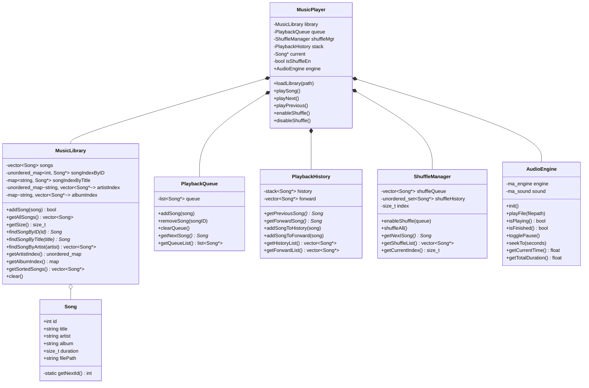
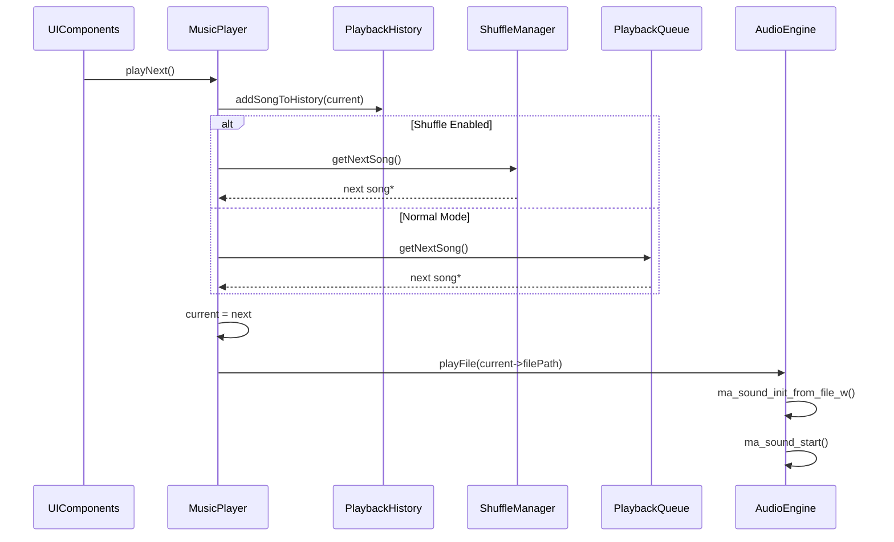
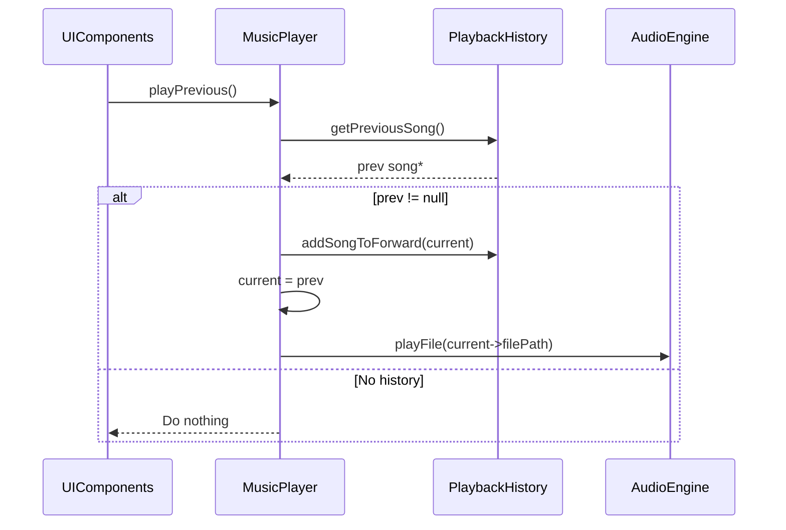
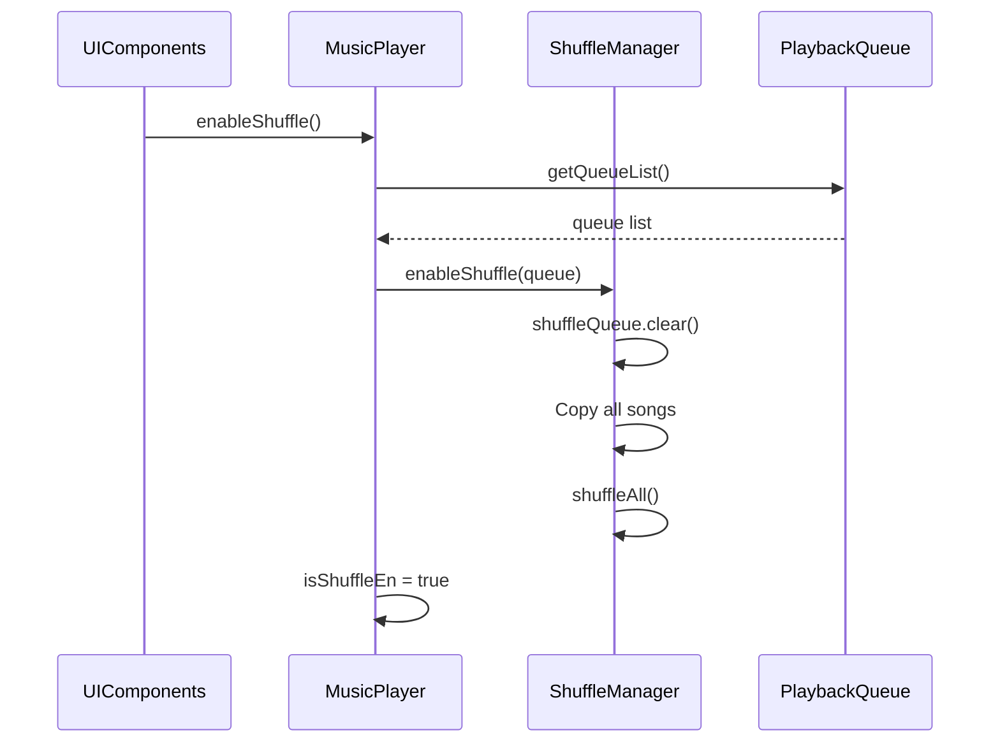
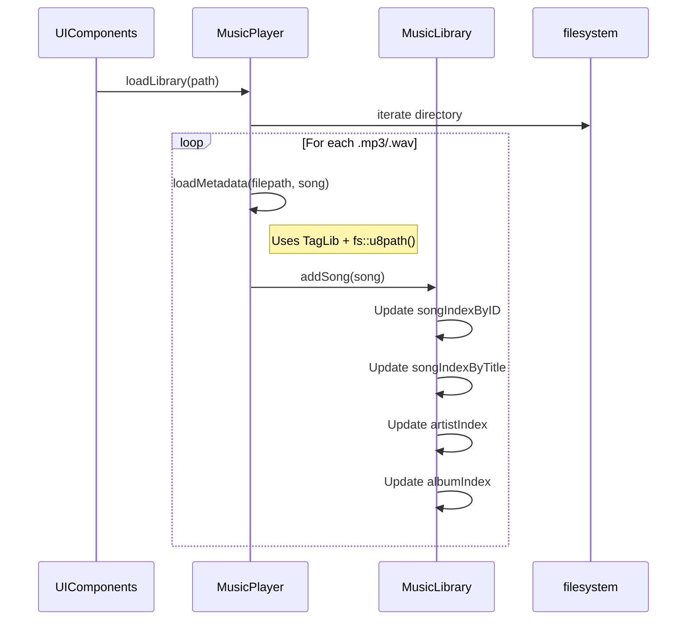

# PhuongTH33 Music Player - UML Documentation

## Class Diagram



---

## Sequence Diagrams

### Play Next Song



### Play Previous Song



### Enable Shuffle



### Load Library



---

## Threading Model

| Component | Thread | Implementation |
|-----------|--------|----------------|
| UI Rendering | Main | GLFW/ImGui loop |
| Audio Playback | Background | miniaudio internal |
| Audio Decoding | Async | `MA_SOUND_FLAG_ASYNC` |
| File Loading | Main | Synchronous |

---

## Data Flow

```
User clicks song → MusicPlayer.chooseAndPlaySong()
                 → PlaybackHistory.addSongToHistory()
                 → AudioEngine.playFile()
                 → miniaudio (background thread)
                 → Audio output
```
